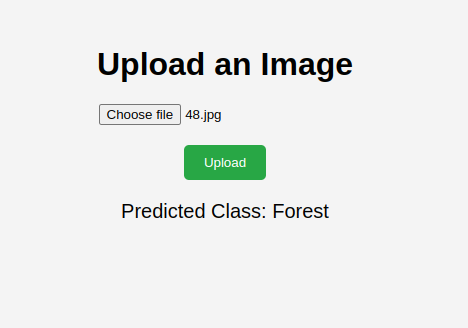

# Image Classification Flask Application

This repository contains a Flask application that allows users to upload an image and get the predicted class.

## Installation

1. Clone the repository
2. Navigate to the project directory
3. Install the required dependencies
4. Place the trained model, scaler, and PCA object files in the `wts` directory.

## Usage

1. Run the Flask application:
2. Access the application in your web browser at `http://localhost:5000`.
3. On the home page, you will see an image upload form. Click on the "Choose File" button and select an image file from your local machine.
4. After selecting the image file, click on the "Upload" button to submit the form.
5. The application will preprocess the uploaded image, extract features, and predict the class using the trained model.
6. The predicted class will be displayed on the page.

